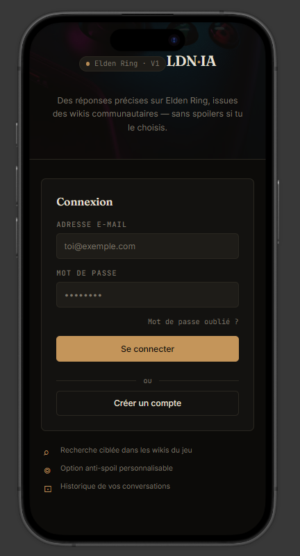
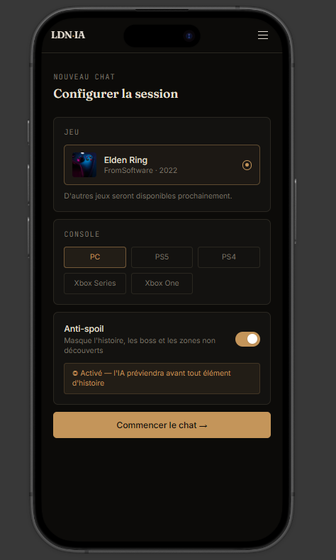
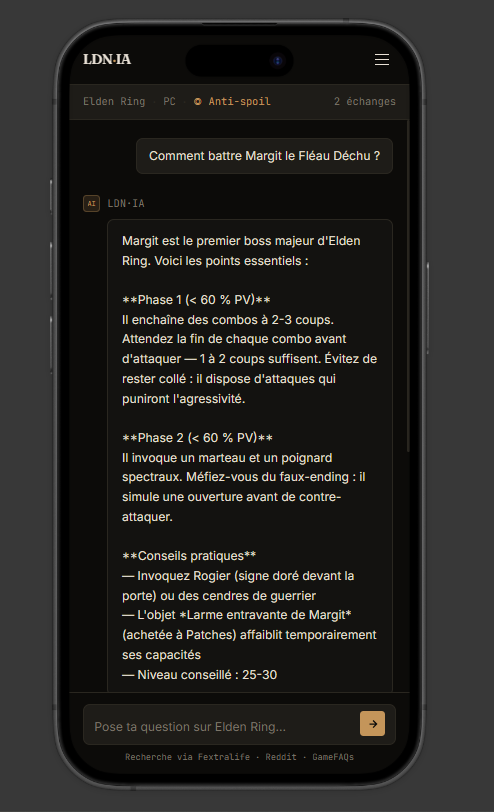

# LDN·AI

**Pour plus de détails, consultez le fichier "cahier des charges.md à la racine du repo**

**Un assistant IA qui répond à tes questions sur un jeu vidéo précis, à partir d'une recherche ciblée dans ses sources communautaires francophones — avec les noms officiels du jeu en français.**

Plutôt que de fouiller des wikis en anglais, des threads Reddit épars et des vidéos YouTube à rallonge, pose ta question directement. La V1 est disponible sur **Elden Ring** ; l'architecture est pensée pour accueillir d'autres jeux sans réécriture de code.

## Le problème

Les assistants IA généralistes répondent vite, mais approfondissent peu leurs recherches et peuvent halluciner des détails précis. Sur un jeu joué en français, on veut aussi des réponses avec les noms officiels français des boss, objets et lieux — pas des termes anglais qui ne correspondent à rien dans ta version.

## Fonctionnalités

- 🔍 **Recherche ciblée** dans les wikis et forums communautaires du jeu sélectionné
- �🇷 **Noms officiels en français** — la recherche cible des sources francophones, donc fini les noms anglais qui ne correspondent à rien dans ta version
- 💬 **Historique de conversations**, par compte
- 📱 **Mobile-first**, pensé pour être utilisé pendant que tu joues

## Aperçu

| Connexion | Configuration | Conversation |
|---|---|---|
|  |  |  |

On choisit son jeu et sa console, puis on pose ses questions — les réponses citent leurs sources plutôt que de sortir un avis générique.

*Maquettes — le développement est en cours.*

## Stack technique

| | |
|---|---|
| Frontend + Backend | Next.js (monolithe), TypeScript, shadcn/ui |
| IA | Groq / OpenRouter (modèles open-weight), via Vercel AI SDK |
| Recherche | Tavily |
| Données jeux | RAWG |
| Base de données + Auth | Supabase |
| Hébergement | Vercel |

## Architecture

Le projet suit une Clean Architecture organisée par feature côté frontend (`domain/`, `infrastructure/`, `application/`, `ui/` pour chaque fonctionnalité), avec une séparation stricte entre routing et logique métier côté backend. Le détail complet — fonctionnement du moteur IA, base de données, sécurité, conformité RGPD — est dans [`CAHIER-DES-CHARGES.md`](./CAHIER-DES-CHARGES.md).

## Installation

```bash
git clone <url-du-repo>
cd <nom-du-projet>
npm install
cp .env.example .env.local # renseigner les clés API (Groq, Tavily, RAWG, Supabase)
npm run dev
```

## Démo

🔗 [lien vers le site en production, à venir]